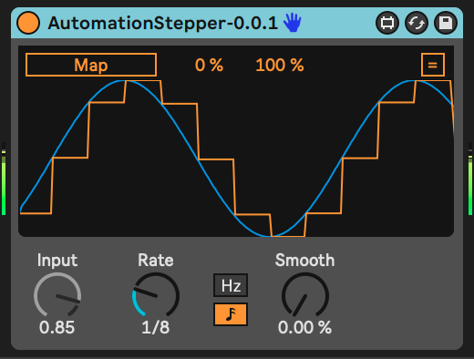

# Automation Stepper

This is a Max For Live device that will turn continuous automation input into stair-stepped output.

For example, you can map an LFO outputting a sine wave to this device's input, then configure the device to generate steps at a tempo-synced or free time interval, automating up to 8 other parameters.

Here is an image AutomationStepper turning a sine wave into 1/8 note steps.

## Installation

[Download the newest .amxd file from the frozen/ directory](https://github.com/zsteinkamp/m4l-AutomationStepper/tree/main/frozen/) or clone this repository, and drag the `AutomationStepper.amxd` device into a track in Ableton Live.

## Changelog

* 2022-04-08 [0.0.1](https://github.com/zsteinkamp/m4l-AutomationStepper/raw/main/frozen/AutomationStepper-0.0.1.amxd) - Initial release.

## Usage

Usually, you would map a MIDI controller or automation source to `Input`. Then choose a step frequency (either in Hz or in note values). You can adjust the smoothing to create a portamento-like effect as the step moves from one value to another.

Use the "Map" button to map the stepped output to another parameter. Click the `[=]` button in the upper left to reveal additional automation destination slots.

## TODO

* ...

## Contributing

I'd love it if others extended this device. If you would like to contribute, simply fork this repo, make your changes, and open a pull request and I'll have a look.

## More

I have many other free and open-source devices available. Visit https://steinkamp.us/music-tools/ to see them all.
